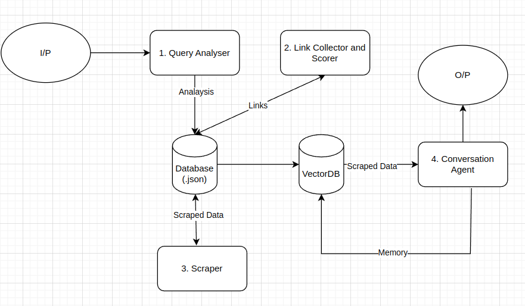

This is a conversational agent designed to search the web for user queries and engage in meaningful conversations based on the retrieved information. It combines web scraping, natural language processing, and conversational AI to provide an interactive and informative user experience.

## Features
- **Web Search Integration**: Fetches relevant information from the web based on user queries.
- **Conversational AI**: Engages in dynamic and context-aware conversations.

## Modules

### 1. **Query Analyser**
    - Parses user input to extract the main intent and keywords.
    - Prepares the query for web search.
    - Handles edge cases like ambiguous or incomplete queries.
    -Extracts key information like dates, locations etc
    -Utilises prompting methods such as CoT (Chain of thought) and One-Shot Prompting: core/prompt/query_breakdown.txt

### 2. **Link Retriever and Scorer**
    -Uses Custom Search Gogle API
    - Interfaces with search APIs (e.g., Google, Bing) or scrapes web pages for relevant content.
    - Filters and ranks search results based on relevance and quality.
    - Ensures compliance with web scraping policies and API usage limits.
    -Filters out links with a low relevancy score
    -If a lot of links get filtered out, moves on to subsequent pages for retrievel of additional links
    -Max link limit is 10 (kept fdue to performance issues)
    -Min limit is 5
    -Score is determined by Gemini: core/prompts/scoring.txt

### 3. **Web Scraper**
    - Utilised Selenium tp handle dynamic websites.
    - Lists, Heading, Paragraphs and tables are all scraped seperately.
    - Implemented a scroll down feature to load entire data before scraping.
    -If an error occurs, current link is skipped
    -Earlier implemented multithreading to improve speed but loading too many webpages crashes my system

### 4. **Conversational Agent**
    - Stores scraped data in a vector database with seperate metadata
    - Usses efficient prompting methods for accurate knowledge rertieval.
    - Memory implementation through ConversatonBufferMemory.
    -Other possible emthods: SUmamrised way of storing meory to reduce tokens, Use ConversationBufferWindowMemory to keep appending each convo onto a vector database
    -Prompt also helps in identifying contradicting results and resolving them: core/prompts/query_retrieval.txt

### 6. **Error Handling**
    - Detects and manages errors such as failed searches or unsupported queries.
    - Provides fallback responses to keep the conversation flowing.
    -Manages rate limit errors 

### **ARCHITECTURE**
